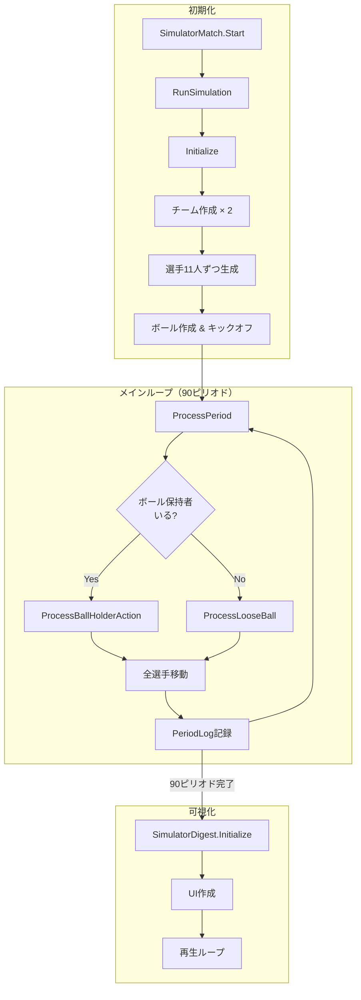
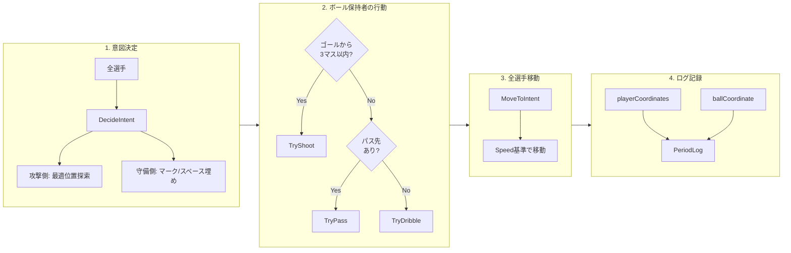

# Simulator スクリプト概要

サッカー試合シミュレーションシステムのアーキテクチャと処理フローをまとめたドキュメント。

---

## 🏟️ ピッチ構造

```
          X: 0  1  2  3  4  5  6
            ┌──────────────────┐
       Y=9  │      Goal_Top    │  ← Away守備ゴール / Home攻撃ゴール
            ├──────────────────┤
       Y=8  │                  │
       Y=7  │    FW (2人)      │
       Y=6  │                  │
       Y=5  │  センターサークル │  ← Ball初期位置 (3,5)
       Y=4  │    MF (4人)      │
       Y=3  │                  │
       Y=2  │    DF (4人)      │
       Y=1  │                  │
            ├──────────────────┤
       Y=0  │    Goal_Bottom   │  ← Home守備ゴール / Away攻撃ゴール
            └──────────────────┘
```

- **サイズ**: 横7マス（X: 0〜6）× 縦10マス（Y: 0〜9）
- **Home**: Y+方向に攻める（ゴール: Y=9）
- **Away**: Y-方向に攻める（ゴール: Y=0）

---

## 🔄 シミュレーション全体フロー



---

## 📋 1ピリオドの処理詳細

### ProcessPeriod メソッドの流れ



---

## 🎯 アクション詳細

### シュート（TryShoot）

```
条件: ゴールまで3マス以内
成功率: baseProb(0.4) + (Shoot/100 × 0.5) - (距離 × 0.1)
成功: スコア+1 → 相手キックオフ
失敗: 相手GKがボール取得
```

### パス（TryPass）

```
成功率: baseProb(0.7) + (Pass/100 × 0.3) - (距離>3 ? (距離-3)×0.1 : 0)
成功: レシーバーがボール取得
失敗: 最寄りの敵がインターセプト or ルーズボール
```

### ドリブル（TryDribble）

```
成功率: baseProb(0.6) + (Dribble/100 × 0.4) - (敵が1マス以内 ? 0.2 : 0)
成功: 前進（Y方向に+1 or -1）
失敗: 最寄りの敵がボール奪取 or ルーズボール
```

---

## 🧠 AI評価システム（GridEvaluator）

### 攻撃側座標評価

| 評価項目 | 重み | 説明 |
|---------|------|------|
| ゴールへの近さ | 1.5 | Y座標がゴールに近いほど高評価 |
| 敵との距離 | 2.0 | 最寄りの敵から遠いほど高評価 |
| パスコース | 1.2 | パスラインが通っていれば加点 |

### 守備側座標決定（役割別）

| 役割 | 動き方 |
|------|--------|
| GK（id%100=0） | X方向のみボールを追跡、Y座標固定 |
| DF（id%100=1〜4） | 守備ラインを維持、ボール方向に寄る |
| MF（id%100=5〜8） | 中盤でボールを追跡 |
| FW（id%100=9〜10） | ボールを積極的に追跡 |

### 味方衝突回避ルール

味方同士が同じグリッドに入ることはない。

- **攻撃時**: 味方がいるグリッドは評価対象からスキップ
- **守備時**: 移動先に味方がいる場合は現在位置に留まる

---

## 🖥️ 可視化（SimulatorDigest）

### グリッドタイル（市松模様）

グリッドの境目を分かりやすくするため、7×10=70枚のタイルを市松模様で配置。

| 設定項目 | デフォルト値 | 説明 |
|---------|------------|------|
| colorGridLight | #A0FFC0 | ピッチ基本色（明るいミントグリーン） |
| colorGridDark | (0.55, 0.88, 0.66) | 少し濃い緑 |
| prefabGridTile | null（任意） | タイル用プレハブ（なければ動的生成） |

### 再生設定

| 設定項目 | デフォルト値 | 説明 |
|---------|------------|------|
| secondsPerMinute | 0.5f | 1ピリオド=0.5秒で再生 |
| cellSize | 80f | 1グリッドのピクセルサイズ |

### スコア表示

スコアは最終結果ではなく、**現在の分までのゴール数を累計**して表示。
シークバーで戻っても正しいスコアが表示される。

```csharp
// 現在の分までのスコアを計算
for (int m = 0; m <= minute; m++)
{
    if (matchLog[m].action == ActionCode.Shoot && matchLog[m].success)
    {
        int scorerTeamId = matchLog[m].actorId / 100;
        if (scorerTeamId == 0) homeScore++;
        else awayScore++;
    }
}
```

### アニメーション（DOTween使用）

```csharp
// 選手移動
playerDots[i].rectTransform.DOAnchorPos(uiCoord, animDuration).SetEase(Ease.OutQuad);

// ボール保持者サイズ変更
playerDots[i].rectTransform.DOScale(Vector3.one * scale, animDuration * 0.3f);

// ボール移動
ballDot.rectTransform.DOAnchorPos(ballUiCoord, animDuration * 0.5f).SetEase(Ease.OutCubic);
```

---

## 📊 データ構造

### PlayerStats（選手能力値）

| パラメータ | 範囲 | 影響 |
|-----------|------|------|
| Speed | 0〜100 | 1ピリオドの移動マス数（70以上で2マス） |
| Shoot | 0〜100 | シュート成功率 |
| Pass | 0〜100 | パス成功率 |
| Dribble | 0〜100 | ドリブル成功率 |

### PeriodLog（ピリオドログ）

```csharp
public class PeriodLog
{
    int minute;                    // 経過分
    int actorId;                   // 行動した選手ID
    ActionCode action;             // 行動種別
    int targetId;                  // パス先ID
    bool success;                  // 成功/失敗
    Coordinate ballCoordinate;     // ボール座標
    Coordinate[] playerCoordinates; // 全選手座標
    bool[] playerHasBall;          // 各選手のボール保持状態
    string description;            // 説明文
}
```

---

## 📝 今後の拡張ポイント

- [ ] フォーメーション設定（4-4-2, 4-3-3 など）
- [ ] 選手ごとの詳細パラメータ追加
- [ ] 守備時のマーク対象指定
- [ ] ファウル/イエローカード判定
- [ ] ハーフタイム処理
- [ ] 延長戦/PK戦
